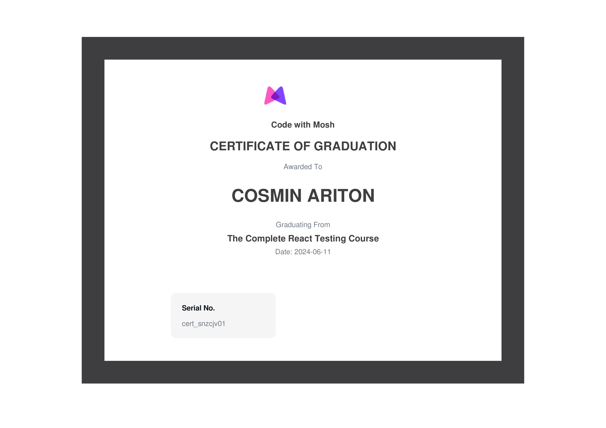

# Course completed

[Certificate as link to file](the-complete-react-testing-course.pdf)



# Course description

# Testing React Apps

This is the starter project for my Reacting testing course where you'll learn everything you need to know to effectively test React apps. You can find the full course at:

https://codewithmosh.com

## About this Project

This is a React app built with the following technologies and libraries:

-   Auth0
-   Tailwind
-   RadixUI
-   React Router
-   React Query
-   Redux Toolkit

Please follow these instructions carefully to setup this project on your machine.

## Setting up Auth0 for Authentication

1. **Sign up for an Auth0 Account:**

    If you don't already have an Auth0 account, you can sign up for one at [https://auth0.com/](https://auth0.com/). Auth0 offers a free tier that you can use for your project.

2. **Create a New Application:**

    - Log in to your Auth0 account.
    - Go to the Auth0 Dashboard.
    - Click on "Applications" in the left sidebar.
    - Click the "Create Application" button.
    - Give your application a name (e.g., "My React App").
    - Select "Single Page Web Applications" as the application type.

3. **Configure Application Settings:**

    - On the application settings page, configure the following settings:
        - Allowed Callback URLs: `http://localhost:5173`
        - Allowed Logout URLs: `http://localhost:5173`
        - Allowed Web Origins: `http://localhost:5173`
    - Save the changes.

4. **Obtain Auth0 Domain and ClientID:**

    - On the application settings page, you will find your Auth0 Domain and Client ID near the top of the page.
    - Copy the Auth0 Domain (e.g., `your-auth0-domain.auth0.com`) and Client ID (e.g., `your-client-id`).

5. **Create a `.env.local` File:**

    - In the root directory of the project, you'll find a sample `.env` file. Make a copy and save it as `.env.local`.
    - Replace the Auth0 Domain and Client ID with the actual values you obtained from Auth0.

## Running the App

Now that you have set up Auth0 and configured your environment variables, you can run the React app using the following commands:

```bash
# Install dependencies
npm install

# Start the development server
npm start
```

This will start the back-end process at `http://localhost:3000`. If port 3000 is in use on your machine, update the port number in the following files and run `npm start` again:

-   json-server.json
-   src/main.tsx
